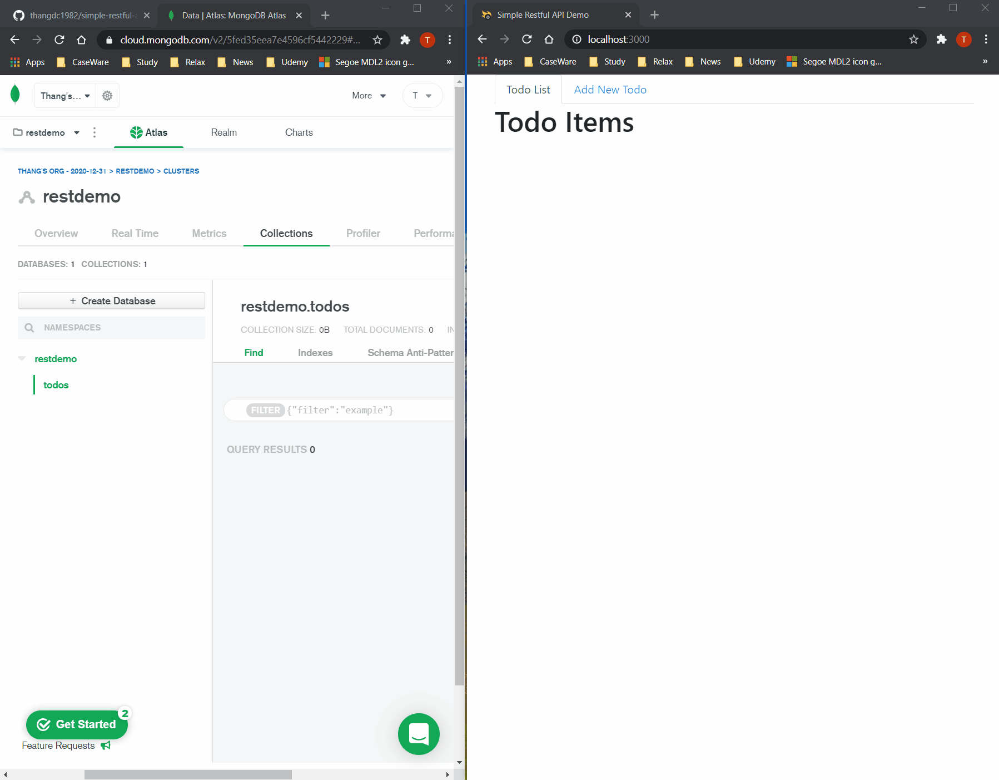

# Demo

# Simple Todo application
Simple todo application to demonstate the full stack application

# Frontend
- React application
- Start at localhost:3000

# Backend
- In the functions folder
- Using Node, Express, mongoDB to handle the Restfull API request from the frontend React Application
- Start at localhost:4000